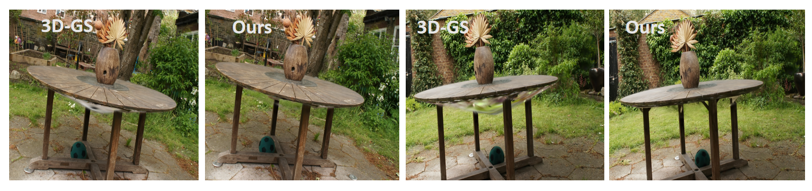

# Bootstrap 3D Reconstructed Scenes from 3D Gaussian Splatting

Project Contribution: [Yifei Gao](https://github.com/yileijin), [Jie Ou](https://github.com/oujieww) <br />


Our Paper: [[`arxiv`](https://arxiv.org/pdf/2404.18669)]


## Overview

In our paper, we present a bootstrapping method that significantly addresses this problem. This approach employs a diffusion model to enhance the rendering of novel views using trained 3D-GS, thereby streamlining the training process.

Our results indicate that bootstrapping effectively reduces artifacts, as well as clear enhancements on the evaluation metrics. Furthermore, we show that our method is versatile and can be easily integrated, allowing various 3D reconstruction projects to benefit from our approach.

<p align="center">

</p>


## Installation

Our program is tested on cuda 11.8 with pytorch==2.0.1, this environment is suitable for both 3D-GS and the stable-diffusion (xformer)

1. Clone this repo:

```
git clone https://github.com/yileijin/Bootstrap-3D-GS.git --recursive
```

2. Install dependencies

```
SET DISTUTILS_USE_SDK=1 # Windows only
conda create -n boot_3dgs python==3.11.8
conda activate boot_3dgs
pip install -r requirements.txt
```

## Data

First, create a ```data/``` folder inside the project path by 

```
mkdir data
```

The data structure will be organised as follows:

```
data/
├── dataset_name
│   ├── scene1/
│   │   ├── images
│   │   │   ├── IMG_0.jpg
│   │   │   ├── IMG_1.jpg
│   │   │   ├── ...
│   │   ├── sparse/
│   │       └──0/
│   ├── scene2/
│   │   ├── images
│   │   │   ├── IMG_0.jpg
│   │   │   ├── IMG_1.jpg
│   │   │   ├── ...
│   │   ├── sparse/
│   │       └──0/
...
```

### Stable Diffusion CKPT

The stable diffusion model we use can be downloaded in [SD2.1v](https://huggingface.co/stabilityai/stable-diffusion-2-1)/[x4-upscaling](https://huggingface.co/stabilityai/stable-diffusion-x4-upscaler)

### Public Data

The MipNeRF360 scenes are provided by the paper author [here](https://jonbarron.info/mipnerf360/). And we test on scenes ```bicycle, bonsai, counter, garden, kitchen, room, stump```. The SfM data sets for Tanks&Temples and Deep Blending are hosted by 3D-Gaussian-Splatting [here](https://repo-sam.inria.fr/fungraph/3d-gaussian-splatting/datasets/input/tandt_db.zip). Download and uncompress them into the ```data/``` folder.

## Training
Our training process is the same as the original [3D-GS](https://github.com/graphdeco-inria/gaussian-splatting), but regarding the Diffusion Model part, we strongly recommend that you make modifications yourself in the configuration ```./arguments ```. Some important configurations are detailed in our paper. For example, to train a scene:

```
python train.py -s <path to COLMAP or NeRF Synthetic dataset>
```


## Novel-view Rendering

Our rendering also includes scenes that are not in the training set or the test set. By setting ```do_expension=True```, you can obtain completely novel views.

```
python render.py -m <path to trained model> # Generate renderings
python metrics.py -m <path to trained model> # Compute error metrics on renderings
```


## Contact

- Yifei Gao: yilei.jin123@gmail.com

## Citation

If you find our work helpful, please consider citing:

```bibtex
@misc{gao2024bootstrap,
      title={Bootstrap 3D Reconstructed Scenes from 3D Gaussian Splatting}, 
      author={Yifei Gao and Jie Ou and Lei Wang and Jun Cheng},
      year={2024},
      eprint={2404.18669},
      archivePrefix={arXiv},
      primaryClass={cs.GR}
}
```

## LICENSE

Please follow the LICENSE of [3D-GS](https://github.com/graphdeco-inria/gaussian-splatting).

## Acknowledgement

We thank all authors from [3D-GS](https://github.com/graphdeco-inria/gaussian-splatting) for presenting such an excellent work.
